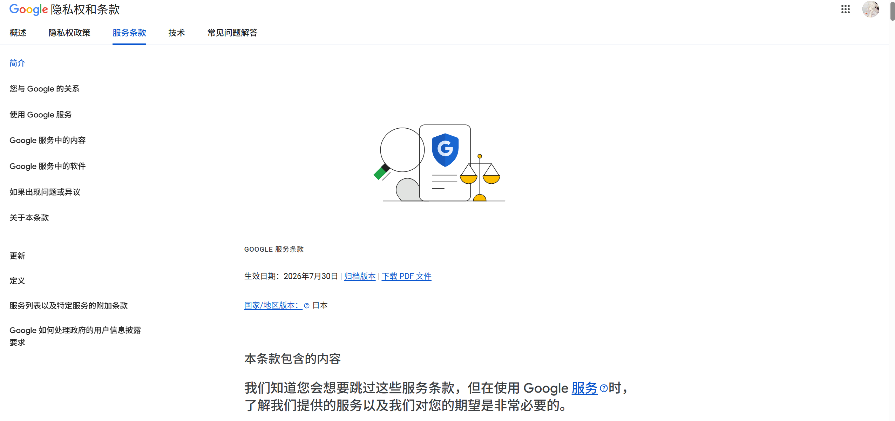
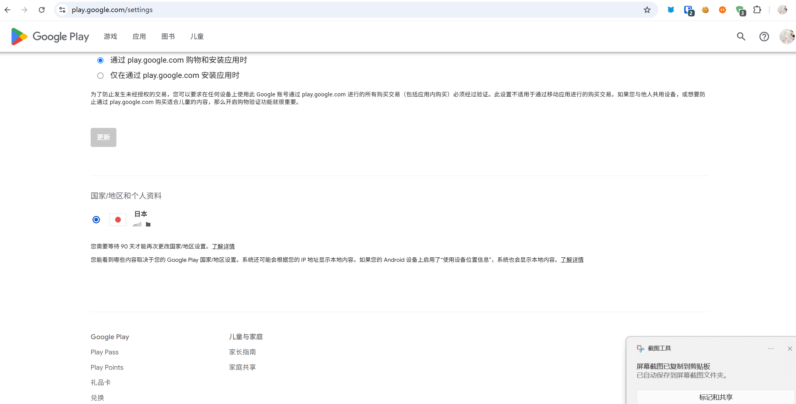

前段时间我准备订阅 ChatGPT，Google 账号的地区明明设置成了日本，但到了付款的时候，价格显示的还是美元。

一开始我以为是 Google 账号地区没有切换成功，或者是 Google Play 的地区设置还没有同步。但折腾了一下之后才发现，**Google 账号地区和付款资料并不是一回事**。

## 问题出在哪里

Google Play 里除了账号本身的地区设置，还有一个独立的「付款资料」。订阅和购买时使用的是付款资料中的国家或地区，而不只是账号显示的地区。

我先打开 [Google Play 设置页面](https://play.google.com/settings) 查看账号地区。在「国家/地区和个人资料」这里，可以看到账号地区已经设置为日本：

账号地区确认无误之后，我又继续检查了付款资料。结果发现，付款资料并没有跟着账号地区一起变化，之前使用的付款资料仍然是美国：

这也是为什么 Google 账号地区已经是日本，但订阅 ChatGPT 时价格仍然显示美元。**账号地区和付款资料是两个独立的设置，不能只检查其中一个。**

## 解决方法

Google 官方对付款资料和 Play 国家/地区的说明，可以看这里：

[更改 Google Play 国家或地区 - Google Play 帮助](https://support.google.com/googleplay/answer/7431675)

我最后的处理方法很简单：重新创建一个日本的付款资料。

大致步骤如下：

1. 打开 [Google Play 设置页面](https://play.google.com/settings)。
2. 在「国家/地区和个人资料」中确认账号地区已经设置为日本。
3. 进一步打开 Google 的付款资料设置，查看当前正在使用的付款资料。
4. 确认原来的付款资料国家或地区是美国。
5. 新建一个付款资料，并将国家或地区设置为日本。
6. 回到 ChatGPT 的订阅页面，重新查看付款币种。

新建日本的付款资料之后，再回到订阅页面，价格就正常显示成日元了。

## 最后

这次排查绕了一圈，最后发现并不是 Google 账号地区的问题，而是付款资料单独保存了一个美国地区。

如果你也遇到「账号地区已经改了，但付款时币种没变」的情况，可以重点检查一下付款资料，不要只看 Google 账号或 Google Play 页面上显示的地区。

另外，Google 官方页面也提醒，国家或地区资料的更新可能需要一段时间，最长可能要等待 48 小时；切换 Play 国家或地区后，余额、应用和部分数字内容也可能受到影响，修改前最好先确认清楚。
