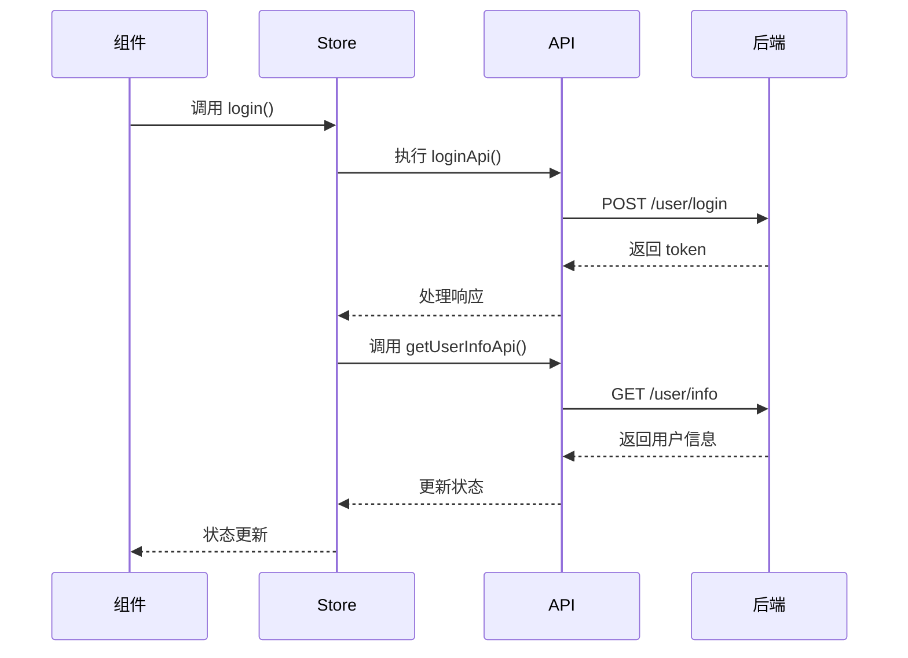

---
title: Pinia的使用
description: Pinia 是 Vue 的专属状态管理库，它允许你跨组件或页面共享状态。
categories:
  - 计算机
tags:
  - 笔记
  - 前端
  - Vue
cover:
status: true
date: 2025-03-23 14:39
updated: 2025-11-25 22:26
column: SpringBoot
slug: '970498'
---

## 一、为什么选择 Pinia？

Pinia 是 Vue.js 官方推荐的状态管理库，它基于 Composition API 设计，具有以下核心优势：

- **模块化**：支持多个 Store 模块独立管理不同业务状态
- **响应式**：基于 Vue3 的响应式系统实现状态自动更新
- **轻量**：体积仅有 ~1KB（gzip 后），性能优异
- **类型安全**：完美支持 TypeScript，提供完整类型推导

在电商应用中，我们常需要跨组件共享购物车、用户登录态等数据，Pinia 可以优雅解决这类问题。

## 二、快速入门

### 1. 安装依赖

```bash
npm install pinia
```

### 2. 初始化 Pinia

```typescript
// src/main.ts
import { createApp } from 'vue'
import { createPinia } from 'pinia'
import App from './App.vue'

const app = createApp(App)
app.use(createPinia()) // 全局注册 Pinia
app.mount('#app')
```

### 3. 解决 TypeScript 类型问题

如果出现类型错误，需确保 `tsconfig.json` 包含以下配置：

```json
{
  "compilerOptions": {
    "moduleResolution": "Node",
    "esModuleInterop": true,
    "skipLibCheck": true
  }
}
```

## 三、Store 模块开发

这里我就拿`用户管理`来说明了

### 1. 用户状态管理模块

```typescript
// src/store/userStore.ts
import { defineStore } from 'pinia'
import { loginApi, getUserInfoApi } from '@/api/user'
import type { LoginParams, UserInfo } from '@/types'

export const useUserStore = defineStore('user', {
  state: () => ({
    token: localStorage.getItem('token') || '',
    userInfo: null as UserInfo | null,
  }),

  actions: {
    // 用户登录流程
    async login(params: LoginParams) {
      try {
        // 1. 调用登录接口
        const { data } = await loginApi(params)

        // 2. 持久化存储 token
        this.setToken(data.token)

        // 3. 获取用户信息
        await this.fetchUserInfo()

        return data
      } catch (error) {
        // 登录失败处理
        this.clearToken()
        throw new Error('登录失败：' + error.message)
      }
    },

    // token 管理
    setToken(token: string) {
      this.token = token
      localStorage.setItem('token', token)
    },

    clearToken() {
      this.token = ''
      this.userInfo = null
      localStorage.removeItem('token')
    },

    // 获取用户信息
    async fetchUserInfo() {
      const { data } = await getUserInfoApi()
      this.userInfo = data
    },
  },
})
```

### 2. Store 入口文件

```typescript
// src/store/index.ts
import { createPinia } from 'pinia'

export const pinia = createPinia()
export * from './userStore'
```

## 四、与 API 层集成

### 1. 请求拦截器自动注入 Token

```typescript
// src/utils/request.ts
import axios, {
  type AxiosInstance,
  type InternalAxiosRequestConfig,
  type AxiosResponse,
  type AxiosError,
} from 'axios'
import { useUserStore } from '@/store/modules/user'

type RequestConfig<T = any> = InternalAxiosRequestConfig<T>
type ResponseData<T = any> = T

const http: AxiosInstance = axios.create({
  baseURL: import.meta.env.VITE_APP_BASE_API,
  timeout: 10000,
})

// 增强的请求拦截器
http.interceptors.request.use(
  (config: RequestConfig): RequestConfig => {
    const userStore = useUserStore()
    if (userStore.token) {
      config.headers = {
        ...config.headers,
        Authorization: `Bearer ${userStore.token}`, // 拿到token
      } as typeof config.headers
    }
    return config
  },
  (error: AxiosError) => Promise.reject(error),
)

// 其他省略...
```

## 五、组件使用示例

### 登录组件调用

```typescript
// src/views/Login.vue
<script setup lang="ts">
import { ref, reactive } from 'vue'
import message from '@/components/message'

// 登录验证
import { useUserStore } from '@/store/modules/user'
import router from '@/router'

const userStore = useUserStore()

// 表单引用
const loginFormRef = ref()

// 表单数据
const loginForm = reactive({
  username: '',
  password: ''
})

// 登录操作
const handleLogin = async () => {
  try {
    // 表单验证
    const valid = await loginFormRef.value.validate();
    if (!valid) return;

    loading.value = true;

    // 调用 Pinia Store 的登录方法
    await userStore.login({
      username: loginForm.username,
      password: loginForm.password
    });

    // 登录成功提示
    message.success('登录成功！');

    // 跳转到首页
    router.push('/home');

  } catch (error) {
    // 登录失败提示
    message.error('登录失败，请检查用户名和密码！');
  } finally {
    loading.value = false;
  }
};
</script>
```

## 六、项目结构规范

```text
src/
├── api/          # API 接口封装
│   └── user.ts   # 用户相关接口
├── store/        # 状态管理
│   ├── userStore.ts # 用户状态模块
│   └── index.ts  # Pinia 入口
├── types/        # 类型定义
│   └── user.ts   # 用户相关类型
├── utils/        # 工具函数
│   └── request.ts  # 封装的 axios 实例
└── views/        # 页面组件
    └── Login.vue # 登录页面
```

## 七、完整数据流



1. **用户输入**：在登录表单填写用户名密码
2. **发起请求**：点击登录时调用 `userStore` 的 `login` 方法，将参数传递给 loginApi
3. **保存 Token**：登录成功后通过 `userStore.setToken()` 保存到 Pinia 和 localStorage
4. **自动注入 Token**：后续请求拦截器会自动携带 Token

## 补充

这里只是简单介绍了一下 pinia 的基础使用(貌似也没有讲)

我是边看 [pinia看这一篇就够了 - 掘金](https://juejin.cn/post/7347207466818895911#heading-16) 边自己查阅资料写的，以后用到再补充吧

还有就是上面数据流图的实现，我还要写一篇来记录一下，因为我对这个规范还不是很熟练。
