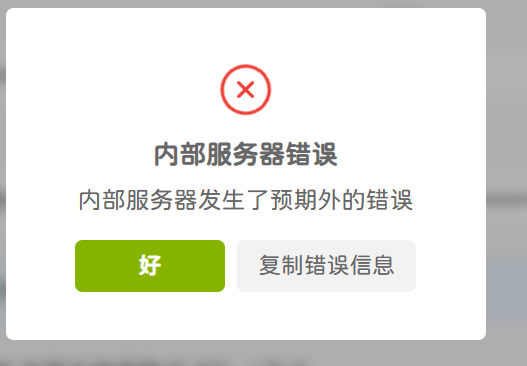

无法上传文件/头像

**问题原因：** 容器内用户是 `sharkey` (uid=991)，但 host 上的 `files` 目录是 `root:root` 所有。

```bash
chown -R 991:991 /opt/1panel/docker/compose/sharkey-stelpolva/files/
```

导入表情无法删除

```text
docker exec -it sharkey-stelpolva-db-1 psql -U sharkey -c 'TRUNCATE TABLE emoji CASCADE;'
```


