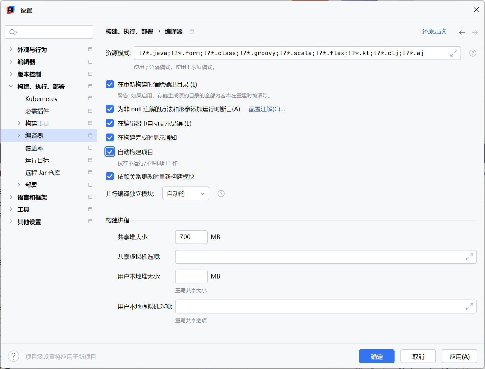

---
title: SpringBoot开启热更新
description: Spring Boot 中实现热更新（热部署）可以显著提升开发效率，以下是几种主流的实现方案及详细配置步骤
categories:
  - 计算机
tags:
  - 笔记
  - SpringBoot
  - Java
  - Vue
cover: https://api.mtyqx.cn/tapi/random.php
status: true
date: 2025-03-22 19:17
updated: 2025-12-25 18:36
Series: SpringBoot
slug: '437763'
column: SpringBoot
---

在 Spring Boot 中实现热更新（热部署）可以显著提升开发效率，以下是几种主流的实现方案及详细配置步骤

---

## 一、Spring Boot DevTools（官方推荐）

**推荐指数**：★★★★★  
**原理**：通过类加载器隔离机制实现快速应用重启  
**配置步骤**：

1. **添加依赖**：

   ```xml
   <dependency>
       <groupId>org.springframework.boot</groupId>
       <artifactId>spring-boot-devtools</artifactId>
       <scope>runtime</scope>
       <optional>true</optional>
   </dependency>
   ```

---

## 二、IDEA 配置：

- `Settings → Build, Execution, Deployment → Compiler`：
  ✅ 勾选 `Build project automatically`（自动编译）
  
- `Settings → Advanced Settings` (高级设置)：
  ✅ 勾选 `Allow auto-make to start even if developed application is currently running(即使开发的应用程序当前正在运行，也允许自动构建启动)`
  

3. **触发更新**：
   - 修改 Java 代码后按 `Ctrl + F9`（手动触发编译）
   - 修改静态资源（HTML/CSS/JS）会自动立即生效

4. **高级配置**（可选）：

```properties
  # application.properties
  devtools:
 add-properties:
   restart:
     enabled: true  #设置开启热部署
     additional-paths: src/main/java #重启目录
     exclude: WEB-INF/**

```

## 三、JRebel（付费）

**推荐指数**：★★★★☆  
**优势**：瞬时热更新，无需重启，支持更多框架  
**使用场景**：大型项目或需要极致热部署体验

1. **安装插件**：
   - IDEA：`Plugins 市场搜索 JRebel 安装`

2. **激活授权**：
   - 教育用户可申请[免费授权](https://www.jrebel.com/products/jrebel)
   - 或使用企业许可证

3. **启用方式**：
   - 启动时选择 `Run with JRebel` 替代常规启动
   - 修改代码后直接保存即可生效

---

## 四、Spring Loaded（第三方方案）

**推荐指数**：★★★☆☆  
**配置方式**：

```xml
<build>
    <plugins>
        <plugin>
            <groupId>org.springframework.boot</groupId>
            <artifactId>spring-boot-maven-plugin</artifactId>
            <dependencies>
                <dependency>
                    <groupId>org.springframework</groupId>
                    <artifactId>springloaded</artifactId>
                    <version>1.2.8.RELEASE</version>
                </dependency>
            </dependencies>
        </plugin>
    </plugins>
</build>
```

**启动命令**：

```bash
mvn spring-boot:run
```

---

## ⚠️ 常见问题排查

1. **修改不生效**：
   - 检查是否在 `Debug 模式` 下运行
   - 确认 IDEA 开启了自动编译（部分版本需手动配置）
   - 查看控制台是否有 `Restarting...` 日志输出

2. **静态资源未更新**：
   - 清理浏览器缓存
   - 确认资源文件位于 `src/main/resources/static`

3. **类加载异常**：
   - 重大结构修改仍需冷启动
   - 尝试使用 `Build → Rebuild Project`

---

## 五、生产环境警告

❗ **重要**：所有热部署工具（包括 DevTools）都 **不能用于生产环境**！务必确保生产部署时已移除相关依赖。

根据项目需求选择最适合的方案，一般推荐优先使用 DevTools + IDEA 原生热加载的组合，兼顾便捷性和稳定性。
