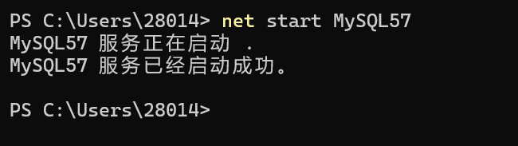

前段时间有个面试题，要求 MySQL 版本为 5.7，而我本机上是 9.5 的版本，所以研究了一下怎么共存。

## 初始化配置文件

首先，从官网上下载一个 MySQL 5.7 版本的压缩包，解压到合适的路径。我这里是放到了`F:\APP\MySQL\mysql-5.7.44-winx64`

需要新建两个文件，文件地址任意，建议按照自己的规范来

- `my.ini` 配置文件
- Data 文件夹，我创建的是`mysql57_data`

配置文件的内容如下，直接复制即可

```ini
[mysqld]
# 1. 端口隔离：3308（避开9.5的3306）
port=3308
# 2. 安装目录（无空格）
basedir=F:\APP\MySQL\mysql-5.7.44-winx64
# 3. 数据目录
datadir=F:\APP\MySQL\mysql57_data
# 4. 进程隔离：避免和9.5共用进程文件
pid-file=F:\APP\MySQL\mysql57_data\mysql57.pid
# 5. 套接字隔离（共存关键，避免和9.5冲突）
socket=F:\APP\MySQL\mysql57_data\mysql57.sock
# 6. 连接数（保留你的配置）
max_connections=200
max_connect_errors=10
# 7. 5.7兼容utf8mb4的完整配置（缺一不可）
character-set-server=utf8mb4
collation-server=utf8mb4_general_ci
init_connect='SET NAMES utf8mb4'
# 8. 存储引擎/认证插件（保留你的配置）
default-storage-engine=INNODB
default_authentication_plugin=mysql_native_password
# 9. 跳过符号链接（5.7必填，避免路径解析错误）
skip-symbolic-links

[mysql]
default-character-set=utf8mb4

[client]
# 客户端端口匹配3308
port=3308
default-character-set=utf8mb4
# 客户端套接字隔离
socket=F:\APP\MySQL\mysql57_data\mysql57.sock
```

> 请确保basedir和datadir按实际路径填写，端口号分隔开

还有一个问题，就是在记事本中选择另存，将字符串编码从 utf 8 改成**ANSI编码**。否则会报错`error: Found option without preceding group in config file`

## 初始化 MySQL

在 `mysql-5.7.44-winx64` 文件夹下**以管理员身份运行**终端，输入以下命令

```powershell
./mysqld --defaults-file="F:\APP\MySQL\mysql-5.7.44-winx64\my.ini" --initialize --console
```

成功后，会返回临时密码，请记住此密码。

## 安装 MySQL

```powershell
./mysqld install MySQL57 --defaults-file="F:\APP\MySQL\mysql-5.7.44-winx64\my.ini"
```

安装成功后，执行启动命令

```powershell
net start MySQL57
```

不出意外的话，终端会正常启动 MySQL 57



## 补充说明

这里需要设置密码，毕竟此时密码是临时的

我使用的是 navicat，所以链接上数据库后自动让我重新设置密码了。你也可以使用命令进行重置
