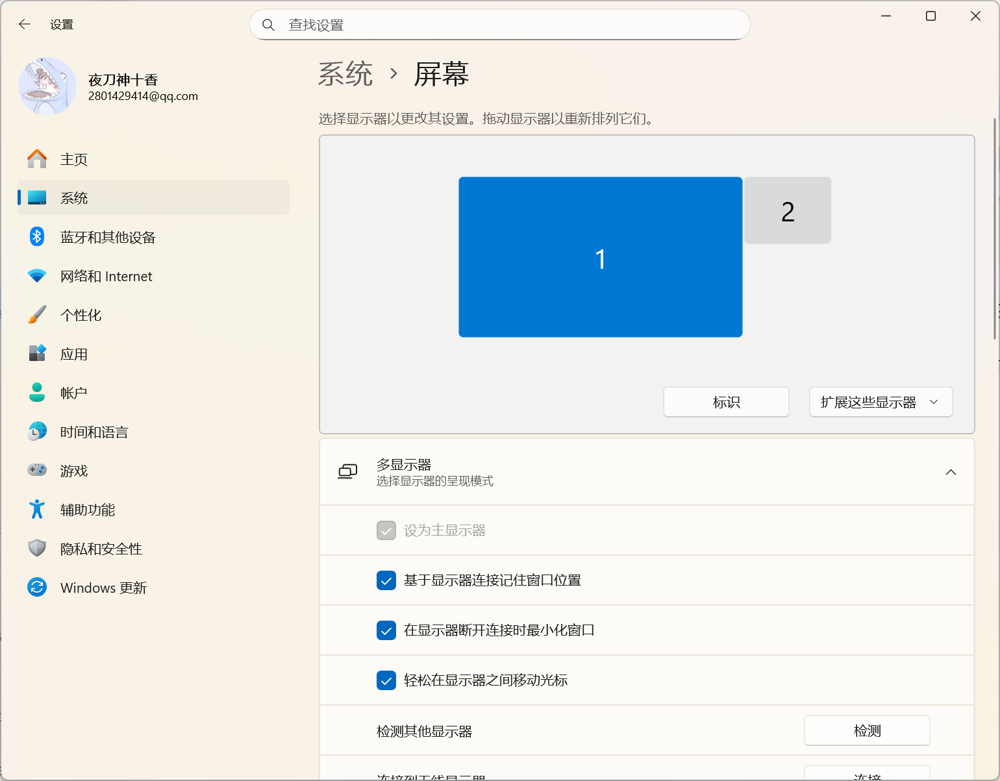

---
title: 如何畅玩旮旯game之软件篇--串流
description: 使用Sunshine基地班和moonlight实现
categories:
  - 大杂烩
tags:
  - 小技巧
column:
cover:
status: true
pinned: false
aiSummary: true
date: 2025-11-08 22:46
updated: 2025-11-10 10:50
slug: '717'
---

因为偶尔想玩玩一些旮旯 game，但是安卓端的模拟器在我的实际使用中，局限性都很大，在研究了半天后，我发现还是电脑直接串流到平板上比较方便。

由于重装电脑后，只能凭着记忆来手动恢复这部分的数据，所以写个博客，记录一下。

## 本文软件

- [Sunshine-Foundation](https://github.com/qiin2333/Sunshine-Foundation)：Sunshine 基地版，电脑端软件
- [moonlight-vplus](https://github.com/qiin2333/moonlight-vplus)：安卓端软件，同Sunshine 基地版作者开发

当然，你也可以选择原版的 [Sunshine](https://app.lizardbyte.dev/Sunshine/?lng=en#Download) 和 [Moonlight](https://moonlight-stream.org/)。此外，这还有一些改版：

- [Apollo](https://github.com/ClassicOldSong/Apollo)：第三方 Sunshine

## Sunshine 基地版

基地版相较于原版，不仅画面风格更加的美观(二次元狂喜)，而且最重要的是有**虚拟显示器**和自适应屏幕大小功能。

虚拟显示器可以让你在平板等设备串流时，电脑进行黑屏待机，而不会亮屏，可以说对宿舍佬非常的友好（毕竟被人发现是个非常社死的事情 QAQ）。原版则是需要外部设备提供，比如说显示屏诱骗器，或者真的有外屏才可以使用。

### 配置

安装完成后，我们可以通过右下角托板打开面板

这个版本的我也是第一次用，看到他内置到软件里了，正常来说端口号是 47990，不过这样也蛮好的，可以快速配置。

配置完成后，我们只需要确保手机下载好 moonlight，以及设备在同一局域网下，正常来说是可以直接识别到 sunshine 的，然后输入 pin 码配对即可。

#### 更改显示设置

电脑端在桌面->右击->显示设置，笔记本改为“**拓展这些显示器**”，台式机改成“仅 1”

否则会出现屏幕分辨率不对的情况

如果还是不对，看看屏幕的分辨率是否正确。对咯，还有个原因，看看手机端的 moonlight 设置里，有个“自动优化主机设置”，这个也会修改电脑屏幕。

Sunshine -> Audio/Video 推荐配置

几个组合设定：

1.无操作：字面意义，没什么用2.自动激活指定显示器：会激活虚拟创建Moonlight所选对应分辨率帧率，Moonlight端会变为副屏（副屏的意思就是拓展屏）也可以串流过去自己按win+p切换到拓展3.自动激活指定显示器并设置为主显示器：激活创建对应分辨率，Moonlight端变为主屏，你的主显示器变为副屏4.禁用其他显示器，只启用指定显示器：激活创建对应分辨率，Moonlight端显示画面，其他显示器禁用熄灭，也就是息屏串流，游戏玩家建议选择第4个

以上状态都是一个物理显示器+虚拟显示器，加上虚拟有3个显示器的具体需要自测

### 结束串流

需要在手机端手动选择退出串流，否则直接退出的话，电脑依然是黑屏状态

### 结语

好像除了分辨率需要注意一下，其他的也没什么了？毕竟现在相较于我之前接触到的，连配置都很少了。

好了，我要去玩了，有问题再补~
