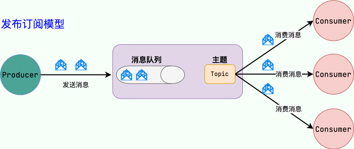

消息队列(Message Queue)，从字面上理解：首先它是一个队列，先进先出的数据结构。消息队列就所谓存放消息的队列。

消息队列解决的不是存放消息的队列的目的，解决的是通信问题。

在实际运用中，如果使用网络通信，也就是同步通信，那么不仅耗时较久，而且过程中受到网络波动的影响，不能保证高成功率。因此，使用异步的通信方式对架构进行改造。比较常见的实例就是电商平台，高峰期，用户可能发来 200 条消息，但是后台只能处理一百条，这时候就需要消息队列了。

## 消息队列的作用

1. 异步处理
2. 削峰/限流
3. 降低系统耦合性

除了这三点之外，消息队列还有其他的一些应用场景，例如实现分布式事务、顺序保证和数据流处理。

## 消息队列的架构

