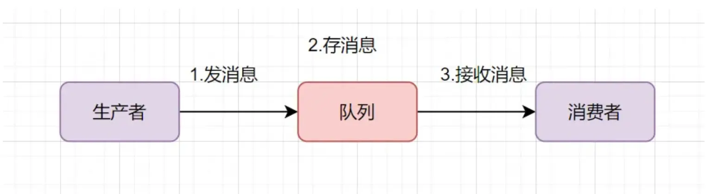
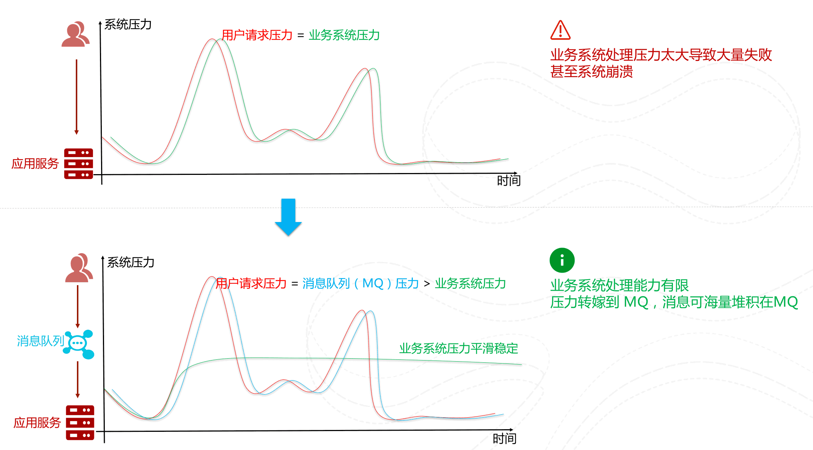
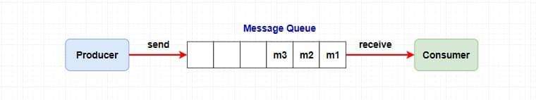

## 什么是消息队列？

消息队列（Message Queue）是一种用于系统之间异步通信的中间件，通过“生产者-消费者”模式解耦系统，提高并发处理能力和系统可靠性。

简单来说，消息队列理解为一个<mark style="color:#bf616a">使用队列来通信</mark>的组件。它的本质，就是个**转发器**，包含**发消息、存消息、消费消息**的过程。由于队列[^1]是一种先进先出的数据结构，所以消费消息时也是按照顺序来消费的。

常用的消息中间件有 `RabbitMQ` `Kafka ` `RocketMQ` 等

## 为什么需要消息队列？

消息队列主要就是为我们的系统带来了三点好处：

- 异步
- 解耦
- 削峰

除了这三点之外，消息队列还有其他的一些应用场景，例如实现分布式事务、顺序保证和数据流处理。

### 异步

第一点，我认为消息队列最核心的能力是 <mark style="color:#bf616a">异步处理</mark>。

以经典的电商秒杀场景为例，如果没有使用消息队列，当用户点击下单后，系统需要同步完成创建订单、扣减库存、记录支付信息等一系列操作。  
在高并发场景下，这种串行处理方式会导致接口响应时间变长，甚至因为数据库压力过大而出现超时或宕机问题。

引入消息队列之后，系统可以在完成核心校验后，先快速生成订单并将后续处理逻辑封装成消息发送到队列中，由消费者异步执行库存扣减、日志记录等操作。

这样做有两个好处：

- 用户请求可以快速返回，提高响应速度；
- 系统压力被分散处理，避免瞬时流量压垮数据库。

### 削峰

在上面瞬时高并发的场景下，避免系统宕机的手段就是 <mark style="color:#bf616a">削峰填谷</mark>。

在秒杀等高并发场景下，流量往往是瞬时爆发的。例如在某一秒内可能有 1 万个下单请求，而数据库的实际处理能力可能只有每秒几千次 次。

如果没有消息队列，所有请求会直接打到数据库，可能导致：

- 连接数耗尽
- CPU 飙升
- 服务雪崩

而引入消息队列后，可以将瞬时的高并发请求先写入队列中，由消费者按照自身处理能力逐步消费。

本质上就是：

> 用“队列”作为缓冲区，将流量洪峰变成平稳流量。

这样即使瞬间流量很高，系统也不会被直接压垮，而是以稳定速率逐步处理。

### 解耦

消息队列带来的另一个核心价值就是 <mark style="color:#bf616a">解耦</mark>。

如果系统之间直接调用，例如：

订单系统 → 调用库存系统 → 调用积分系统 → 调用通知系统

这种强依赖模式存在两个问题：

1. 下游系统异常会影响上游系统
2. 业务扩展困难，新增功能需要修改原有代码

引入消息队列后，订单系统只需要发送一条“订单创建成功”的消息：

- 库存系统监听处理
- 积分系统监听处理
- 通知系统监听处理

订单系统无需关心具体有多少个消费者，也无需关心它们如何处理。

这种模式带来的好处：

- 系统之间低耦合
- 扩展新功能只需新增消费者
- 某个下游系统故障不会直接影响主流程

### 总结

总体来说，消息队列的核心价值在于通过异步化提升响应速度，通过削峰填谷保护系统资源，通过解耦提高系统扩展性和稳定性。

当然，引入消息队列也会带来复杂性，例如消息丢失、重复消费等问题，需要通过确认机制和幂等设计来解决。

## 消息队列有什么缺点？

有句老话叫做“没有银弹[^2]”，消息队列也会有它的缺点：

- 系统复杂性提高：引入 MQ 后，需要额外处理消息确认、重试机制、重复消费、死信队列等问题，整体架构比同步调用更复杂。
- 系统可用性降低：MQ 本身成为新的依赖组件，一旦消息队列宕机或网络异常，可能影响整个业务流程。
- 数据不一致问题：由于消息是异步处理，可能出现“消息发送成功但消费失败”或“本地事务成功但消息发送失败”的情况，系统通常只能保证最终一致性。

### 消息重复消费怎么解决？

实际项目中一般会通过**幂等设计 + Redis 或数据库唯一索引**来解决消息重复消费问题。

- 幂等性处理: 让同一条消息无论被消费多少次，结果都一样，比如通过唯一业务 ID 判断是否已经处理过。
- 去重表 / 唯一索引: 在数据库中记录消息 ID 或业务 ID，设置唯一索引，如果重复插入则直接失败，从而避免重复处理。
- Redis 去重: 将消息 ID 存入 Redis（如使用 SETNX），消费前先判断是否已存在，存在则说明已经消费过。

总体来说，需要业务端自己做控制解决。

## 消息队列是参考哪种设计模式？

观察者和发布-订阅模式。

### 观察者

观察者模式是一种行为型设计模式，它定义了一种一对多的依赖关系，当对象状态发生变化时，会自动通知所有依赖它的对象。

观察者模式一般通过 **维护一个观察者列表（List）** 来实现。

基本流程：

1. 被观察者维护一个 **观察者集合**
2. 观察者注册到被观察者
3. 被观察者状态发生变化
4. 遍历观察者列表，逐个通知

简单来说就是：

> **被观察者保存观察者 → 状态变化 → 依次调用观察者的方法**

比如在奶茶店里，员工会关注原料库存的变化。当库存不足时，系统会直接通知所有相关员工去备料。这里员工就是观察者，库存系统就是被观察者，一旦库存变化就会直接通知员工处理。

### 发布-订阅模式

发布订阅模式是通过消息中间件或事件中心进行消息传递，发布者和订阅者之间没有直接关系。

奶茶店接到顾客订单后，订单会先进入订单系统，然后不同岗位的员工根据订单系统获取自己需要处理的信息，比如制作饮料的员工只处理饮品订单。这里订单系统就相当于消息中间件，顾客是发布者，员工是订阅者。

### 消息队列为什么不用观察者模式，而要用发布订阅模式？

观察者模式耦合度高，不适合分布式系统。可以往下继续了解

### 队列模型和主题模型

早期的消息中间件是通过 **队列** 这一模型来实现的，后来我们都习惯把消息中间件称为消息队列。但是如今例如 RocketMQ、Kafka 这些优秀的消息中间件不仅仅是通过一个 **队列** 来实现消息存储的。

#### 队列模型

**特点**：一个消息只能被一个消费者消费。

但是如果我们需要将一个消息发送给多个消费者，使用队列模型就不能很好的解决问题了，虽然我们可以将队列复制给每一个消费者，但这样会带来资源和性能的损耗。这样子还会导致生产者需要知道具体消费者个数然后去复制对应数量的消息队列，违背了**解耦**的原则。

#### 主题模型

为了解决上面的问题，

## RocketMQ

### 为什么选择？

- **开发语言**：RocketMQ 使用 Java 开发，方便阅读理解源码
- **社区氛围活跃**：阿里巴巴开源，说明确实经得起实际考验
- **性能强大**：支持10亿级别消息堆积，堆积不影响性能

---

[^1]: 队列是一种特殊的[线性表](https://baike.baidu.com/item/%E7%BA%BF%E6%80%A7%E8%A1%A8/0?fromModule=lemma_inlink)，特殊之处在于它只允许在表的前端（front）进行删除操作，而在表的后端（rear）进行插入操作，和栈一样，队列是一种操作受限制的线性表。

[^2]: “银弹”这个词来自传说，说一颗银子打造的子弹可以一枪解决掉怪物，是一种万能武器。软件行业借用了这个概念，把“银弹”指代为：一种被期望可以一次性解决软件开发所有难题、让事情彻底变简单的完美技术。
